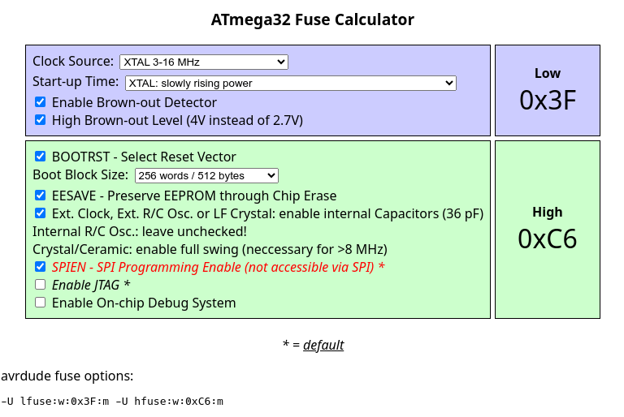
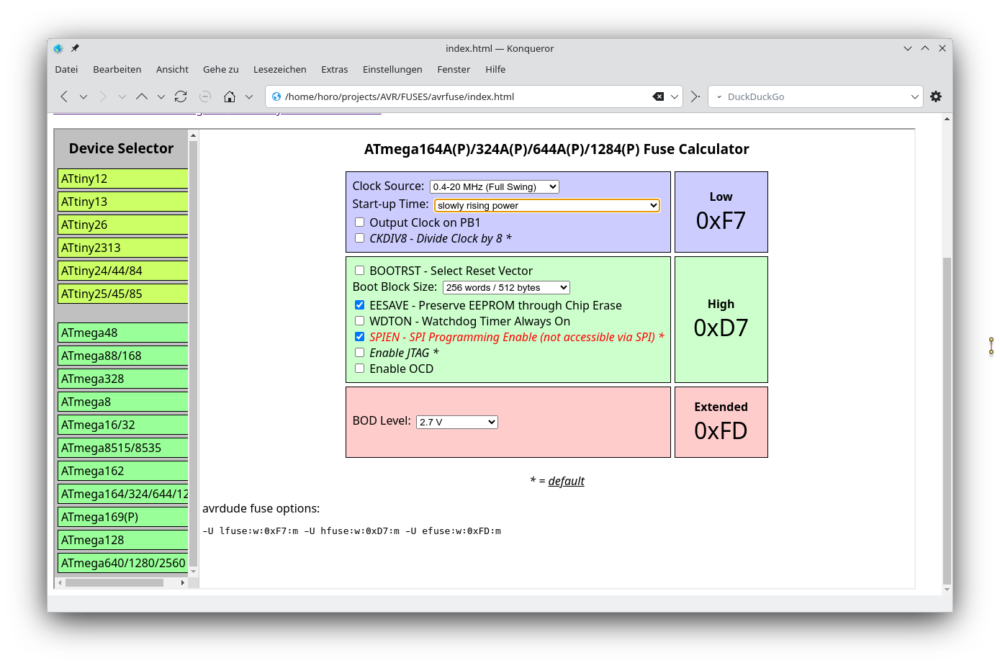

# Z80-MBC2 HW setup

The original project uses an ATmega32 processor for IOS, regularyly clocked with 16 MHz.
An overclocking option of 20 MHz exists but it exceeds the max clock of the ATmega32.

Recent IOS versions support the ATmega1284p processor that allows a max clock frequency
of 20 MHz (in spec) with an overclocking option of 24 MHz (out of spec).

## Set ATmega32 Fuses



```sh
avrdude -v -patmega32 -cstk500 -P /dev/ttyUSB0 -e -Ulfuse:w:0xBF:m -Uhfuse:w:0xC7:m
```

## Set ATmega1284p Fuses



```sh
avrdude -v -patmega1284p -cstk500 -P /dev/ttyUSB0 -Ulfuse:w:0xF7:m -Uhfuse:w:0xD7:m -Uefuse:w:0xFD:m
```
