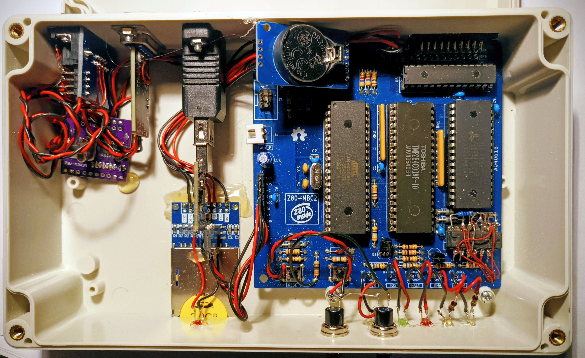
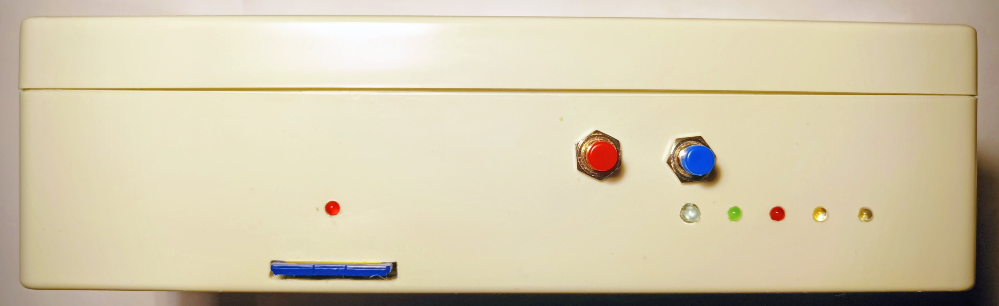
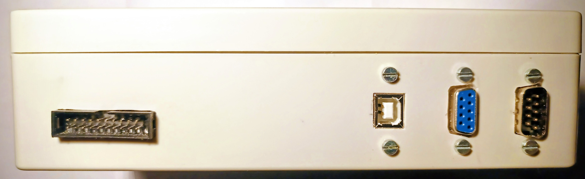
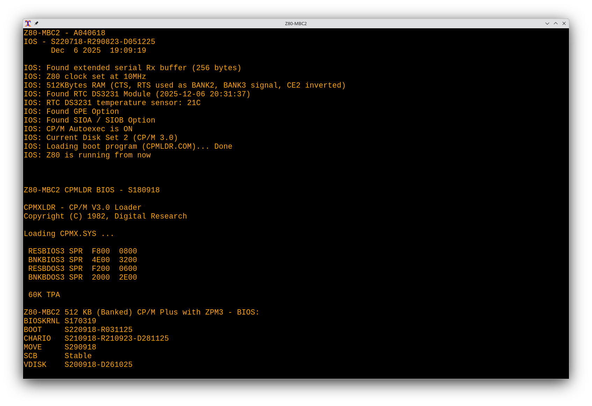

# Z80-MBC2-NG - The Next Generation

SuperFabius' original project [Z80-MBC2](https://hackaday.io/project/159973) seems on hold on
[GitHub](https://github.com/SuperFabius/Z80-MBC2) since April '24. Further development was mainly carried out by
[SvenMb](https://github.com/SvenMb/Z80-MBC2) and myself in the
[forum](https://forum.classic-computing.de/forum/index.php?thread/19422-z80-mbc-2-aufbau-und-inbetriebnahme/)
of the German club `classic-computing.de`. This repository therefore focuses on documenting
and organising the progress of our ongoing work.






## Highlights

- ATmega32 with 16 / 20 MHz (Z80 clock 8 / 10 MHz) or ATmega1284p with 20 / 24 MHz (Z80 clock 10 / 12 MHz).
- Z80 [TinyBASIC2](TinyBasic2/README.md) (improved Palo Alto Tiny BASIC) in IOS FLASH.
- Z80 Monitor [WozMon](IOS-Z80-MBC2-NG/README_wozmon.md) in IOS FLASH.
- Intel HEX file loader in IOS that can load to complete Z80 address range.
- Original BIOS source code in Z80 syntax (`*.MAC`) and using Z80 opcodes.
- Two new physical serial devices `SIOA` and `SIOB`, connected to the `I2C` bus.
- The SIOs provide 64 byte RX and TX buffer and (optional) automatic RTS/CTS handshake.
- All original CP/M baud rates plus additional 14400, 28800, 38400, 57600 and 115200 Bd.
- CP/M `MAKEFILE` allows the faster build with CP/M tools that translates only changed parts.
- Linux `Makefile` allows the the cross-build using original CP/M tools under CP/M 2.2 emulator
[tnylpo](https://gitlab.com/gbrein/tnylpo).
- `IOS-Z80-MBC2-NG.ino` supports up to 512 Kbyte RAM (with HW modification) that is used
as data and directory buffer.
- Bootloader flashes the Z80-MBC2 USER LED during data upload.
- IOS support for Z80 interrupt modes `IM0`, `IM1` and `IM2`.
- `Makefile` allows the compiling of the `*.ino` under Linux via
[arduino-cli](https://arduino.github.io/arduino-cli/latest/) tool.

The zipped disk drive image `SD/DS2N13.DSK.zip` (CP/M3 drive `N:`) contains the
source code, all build tools, and the binaries for a banked CP/M3 version.

The development process is discussed in detail in this (German) forum thread [Z80 MBC 2 - Aufbau und Inbetriebnahme](https://forum.classic-computing.de/forum/index.php?thread/19422-z80-mbc-2-aufbau-und-inbetriebnahme/).

## HW preparation for SIOA & SIOB

Obtain an *SC16IS752 I2C/SPI Bus Interface to UART* Module (or *UART expander*),
select I2C mode and address `0x90` - connect `A0` and `A1` to `Vdd` (3.3V).
Don't be confused, the data sheet uses the 8-bit address `0x90`, while
IOS uses the 7-bit address `0x48h` (i.e. 0x90 >> 1), both are identical.

Attach the module to the Z80-MBC2, directly connecting the 4 lines:
- Vcc
- GND
- SCL
- SDA

No need for external pullup resistors. The SC16IS752 operates on 3.3 V,
but all inputs tolerate the 5 V signals coming from the Z80-MBC2.

The BIOS supports automatic HW handshake via RTS/CTS, therefore it is
recommended to route the signals TxD, RxD, RTS, and CTS with correct
RS232 level to the interface connector(s), e.g. using two
[MAX3232 RS-232 line driver and receiver modules](DOC/RS232_bottom_mod.jpeg)
for both SIO channels.

These level shifters are available as a cheap small module, even with a
DB9 connector, search the typical sources for
*"Converter RS232 - UART with connector DB9 - SP3232 3.3V/5V"*.

I decided to use the DCE (female) connector for SIOA b/c this allows the direct
connection of an USB-RS232 interface or a real PC serial I/O.

## HW modification for 512 KB RAM

With a minor [HW modification](HW-DOC/A040618-SCH_256_512_2.pdf) the Z80-MBC2 can use a RAM IC 
either with 128 KB or 512 KB of memory via IOS boot option, which gives a 32K
common bank at 0x8000..0xFFFF and 3 or 15 32K banks that can be switched
to 0x0000..0x7FFF. Some of the additional banks are allocated as CP/M directory
and data buffers by `gencpm.com` via `gen512k.dat`, speeding up the *"disk"* access.
9 of the 12 new banks are currently unallocated and can be used e.g. for a RAM disk.

- Cut the connection U2/19 (Z80 /MREQ) --- U4/22 (RAM /CE1)
- Cut the connection U3/3 (AVR RAM_CE2) --- U4/30 (CE2)
- Add the parts in the dotted boxes: 4 Schottky diodes, 2 x 1K0 resistors, 1/4 74HC32

```
            ............................        ...............................
            :             (CE2 128K)   :        :  (RAM_CE2)     4 +--\       :
U3/29 PC7  ------/<--+---- A18 U4/30 -----/  /----- PB2  U3/3 -----|---| 6    :
            :        |                 :  CUT   :                5 |   |---+  :
            :  +-/<--+--/\/\/\--> 5V   :        :              +---|---|   |  :
            :  |                       :        :              |   +--/    |  :
U1/6  /A15 ----+-/<--+--/\/\/\--> 5V   :        :              | 74HC32B   |  :
            :        |                 :        ...............|...........|...
U3/16 PD2 -------/<--+----  A17 U4/1   :                       |    CUT    |
            ............................         /MREQ U2/19 --+---/  /----+--- U4/22 /CE1

          Add 4 Schottky diodes, 2 x 1K0        Cut /CE1 and CE2 at U4 and add 1/4 74HC32
```

## Z80 interrupt handling

IOS provides two interrupt sources for the Z80, RX and SYSTICK, which can be activated
either from IOS, e.g. for BASIC (RX) and FUZIX (RX and SYSTICK) or from the Z80 side
with the IOS call `SETIRQ` (0x0E). The original IOS only works with the Z80 IM1, which
responds to INT ACK with a fixed call of `RST 38`, regardless of what is on the data bus.

IOS-NG supports also `IM0` and `IM2`, the new IOS opcode `SETVECTOR` defines the byte
that will be placed on the address bus during INT ACK (/IORQ without /RD or /WR).
This can be either an opcode for `IM0` (typically `RST XX`) or the low byte of the
interrupt vector for `IM2` (the high byte comes from Z80 register `I`).
The content of the data bus is ignored in `IM1`.

### Testing the interrupt modes

For testing purposes, there are some versions of the Basic interpreter in directory
[BASIC](BASIC) that can be loaded via iLoad. Their names are self-explanatory:
`basic47_im0.hex`, `basic47_im1.hex`, `basic47_im2.hex` with RX INT and SYSTICK INT,
which causes the user LED to flash. All files use the same BASIC source code `basic.asm`,
and an init module `init_im.asm` with different defines in the `Makefile`.
In addition, there is the original BASIC `basic47.hex` (`init.asm` + `basic.asm`),
which only uses IM1 for RX INT.

## Optional HW modification for freeing Z80 I/O-Addr range 0x40..0xFF

The Z80-MBC2 occupies all 256 I/O addresses for the IOS interface, even if only the two addresses
0x00 and 0x01 are used. With two of the remaining OR gates (`74HC32C`,`74HC32D`) from the RAM mod,
the IOS address range can be restricted to `0x00..0x3F`, thus freeing up the range `0x40..0xFF`
for own experiments. The 3rd OR device `74HC32A` provides the `/INT_ACK` signal
(`/IORQ` together with `/M1`). This signal is wire-ored with the restricted `/IORQ_IOS` range
to activate the Z80 `/WAIT` for IOS operation.
The modification works perfectly with all three interrupt modes as described above.

```
Cut the connection /IORQ ---/ /--- U1/9 and add the devices in the dotted box
                                                       /S
   U2/20                    CUT                         9 +--\  Q
   Z80 /IORQ --------o-----/  /-----o----o---o------------|   | 8
                     |              |    |   |         10 |   |O--o-->|--/\/\--|
.....................|..............|....|...|......  +---|   |  /   D3   R6  GND
:                    |              |    |   |     :   \  +--/  /   LED
:                    |              V    V   \     :    \ U1C  /
:                    | 9 +--\     D ~  D ~   /  R  :     \    /
:  U2/37  13 +--\    o---|---| 8    |    |   \ 1K0 :      \  /
:  Z80 A7 ---|---|   |10 |   |------+    |   /     :       \/
:         12 |   |---|---|---| /IORQ_IOS |   |     :       /\
:  Z80 A6 ---|---| 11|   +--/            |   |     :      /  \
:  U2/36     +--/    | 74HC32C           |   |     :     /    \
:          74HC32D   |                   |   V     :    /      \
:                    | 1 +--\            |  Vcc    :   /  +--\  \
:                    +---|---| 3         |         :  +---|   |  \
:                      2 |   |-----------+         :   12 |   |O--o--- /WAIT
:  U2/27 ----------------|---|  /INT_ACK           :  +---|   | 11
:  Z80 /M1               +--/                      :  |13 +--/  /Q
:                      74HC32A                     :  |/R  U1D
:  Add 3/4 74HC32, 2 Schottky diodes D, and R 1K0  :  +-------------- /WAIT_RES
:...................................................
```
My [1st modification](HW-DOC/IO_mod_20_FF.md) did not support Z80 interrupts.

I am planning to connect a 64-pin DIN 41612 socket with reduced
[ECB](https://en.wikipedia.org/wiki/Europe_Card_Bus) assignment, which provides the signals                  required for Z80 I/O:

    GND, VCC, /RESET, CLK, A0..A7, D0..D7, /IORQ, /RD, /WR, /INT

## System preparation

### CP/M update

Unzip the drive `N:` image [`DS2N13.DSK.zip`](SD/DS2N13.DSK.zip).
Take out the SD-card and copy the file `DS2N13.DSK` to the root directory,
replacing the old (previously) empty CP/M3 disk image for drive `N:`.
Make a backup of the old disk image if you like.
You can also use any other CP/M3 drive except `A:` aka `DS2N00.DSK`, just
rename the `DS2N13.DSK` file accordingly.

You should also regularly make copies of your working drive `A:` image `DS2N00.DSK`,
e.g. as `DS2N00.SAV`. This allows you to go back at any time in case of problems.

### IOS update

The new BIOS requires an updated IOS, ver. S220718-R290823-D051225 or later.

#### Update via ISP

If you want to perform the update via the serial bootloader, first load one of the files
`IOS-Z80-MBC2-NG_BL_ATmega32_??MHz.hex` via ISP (unless you have already installed
a bootloader, in which case you can proceed directly to the next section).

Check/set the correct AVR fuse values `lfuse = 0x3F`, `hfuse = 0xC6`
(avrdude: `-U lfuse:w:0x3F:m -U hfuse:w:0xC6:m`), see also [this document](IOS-Z80-MBC2-NG/README.md)
and program the hex file with your programmer.

#### Update via bootloader

Subsequent updates can be performed via the serial interface using the Arduino IDE (or CLI)
or directly via avrdude using the `urclock` protocol
(`avrdude -p m32 -c urclock -U IOS-Z80-MBC2-NG_ATmega32_xxMHz.hex`),
without having to reconnect the HW programmer.
The bootloader option depends on the serial DTR Reset.

#### Extended RX buffer for CP/M XMODEM

Instead of 'hijacking' the LTO linker option of the MightyCore library
there's now an extra menu point `Serial Port Buffers (RX/TX)`,
select `128/64` or `256/64`:

```
  Default
  64/64
  128/64
  128/128
  256/64
  256/128
  256/256
```

You can use the provided [`*.diff`](IOS-Z80-MBC2-NG/arduino15_packages_MightyCore_hardware_avr_3.0.3_boards.txt.diff)
file to change the MightyCore library,
go to the directory with the `boards.txt` file and apply the patch.
These are the Linux and Windows locations for the current library version:
- /home/<username>/.arduino15/packages/MightyCore/hardware/avr/3.0.3
- C:\Users\<username>\AppData\Local\Arduino15\packages\MightyCore\hardware\avr\3.0.3

### iLoad

The file `iLoad.h` is built from the source code in `iLoad.asm` that was found
as `S200718 iLoad.asm` in the `src` directory of the zipped SD card `SD-S220718-R290823-v2.zip`.
`iLoad.asm` can be assembled with the linux [z80assembler](https://github.com/Ho-Ro/Z80DisAssembler).
The content of `iLoad.h` is byte-by-byte identical to `boot_A_[]` in the original `IOS*.ino`.

## Testing

For a first test you can execute `N:TESTCPM3.COM`.
This boots your system with the new BIOS showing someting like:

```
...
60K TPA

Z80-MBC2 512 KB (Banked) CP/M Plus with ZPM3 - BIOS:
BIOSKRNL S170319
BOOT     S220918-R031125
CHARIO   S210918-R210923-D281125
MOVE     S290918
SCB      stable
VDISK    S200918-D261025

A>
```
Pressing the `RESET` button brings you back to the original system.

## Installation - the simple way

If it works you can copy `N:CPM3.SYS` to `A:CPM3.SYS` - ready.
Your system will now start up with the new BIOS.

## Installation - the safe way

If you want a quick fallback-solution w/o SD-card handling keep your
original `A:CPM3.SYS` and copy the file `N:CPM3.SYS` to `A:CPMX.SYS`.
This can be done with `PIP A:CPMX.SYS=N:CPM3.SYS` or `MAKE INSTALL` from `N:`.
To be able to boot either the original `CPM3.SYS` or the new `CPMX.SYS`, copy
the provided file [`cpmxldr.com`](bios_devel.linux/cpmxldr.com) as `CPMXLDR.COM`
to the root directory of the Z80-MBC2 SD card. If IOS detects `CPMXLDR.COM`
during CP/M3 boot it uses this loader and switches the USER LED on as an info.
Now you can press the USER KEY to fall back to the old system.
If the USER KEY is pressed, `A:CPM3.SYS` is loaded w/o trying to load `CPMX.SYS`.
If the USER KEY is not pressed, `CPMXLDR.COM` tries to load `A:CPMX.SYS` first
and if it doesn't find `A:CPMX.SYS` then it loads `A:CPM3.SYS`.
The USER LED is switched off for the regular `CPMX.SYS` and switched on as a hint
that the old fallback system was loaded.
This procedure is strongly recommended if you want to modify your BIOS.

## Utilities

Also included are source and binaries of utility programs for these SIOs,
i.e. `DEVMODE.PAS` / `DEVMODE.COM` to handle all supported baud rates and the
assignment of physical devices to the logical devices `CRT:`, `AUX:`, `PRN:`
and `VERBOSE.PAS` / `VERBOSE.COM` to support debugging of the IOS functions.

### Device configuration

The tool `DEVMODE.COM` (located in [`cpm_tools`](cpm_tools)) can be used
to set all possible baud rates 50 Bd .. 115200 Bd and disable (`NONE`)
or enable HW handshake (`RTSCTS`) for a physical device `PD`
or attach one or more physical device(s) `PD` to a logical device `LD`.

```
DEVMODE v.0.6
Usage: DEVMODE [ PD [BAUD] [HDSH] | LD [PD [PD] ... ] | /H[ELP] ]

  - Set the baud rate or handshake mode of a physical device
    PD:   Physical Device Name, one of:
          CRT LPT SIOA SIOB
    BAUD: Baud rate, one of:
             50     75    110    134    150    300    600   1200
           1800   2400   3600   4800   7200   9600  19200  14400
          28800  38400  57600 115200
    HDSH: Handshake mode, one of:
          NONE, RTSCTS, XONXOFF

  - Display or set logical to physical device assignment
    LD:   Logical Device Name, one of:
          CONIN: CONOUT: AUXIN: AUXOUT: LSTOUT: CON: AUX: LST:
    PD:   Physical Device Name, as above
```

## Build your own CP/M3 BIOS

### Using the CP/M toolchain

Building and installing is controlled by `MAKE.COM` and the `MAKEFILE`.
Implement your modifications with your editor of choice, e.g. `WS.COM` or
`TURBO.COM`; enter `MAKE` and the new system will be created.
`MAKE.COM` checks the dependencies defined in `MAKEFILE` and and creates the
file `MAKE@@@.SUB` with all necessary commands to resolve these dependencies.
It will only rebuild the modules with modified source code to speed up the
build (this feature requires a working RTC).
At the end of this analysis process the file `MAKE@@@.SUB` is automatically
executed and deleted after completion.
Test the result with `TESTCPMX` and install it as described above.
The disk image `DS2N13.DSK` contains all necessary tools needed for a build
on any recent Z80-MBC2 system.
In order to use the new `SIOA` and `SIOB` devices in the improved BIOS, it is
also necessary to update the IOS to the version maintained here.

### Cross build on Linux

CP/M takes some minutes for a complete build due to slow *'disk'* access.
Also the editing is slow and error prone due to the limitation of only
one source code file - aren't we all used to do a quick copy/paste?
I've set up a tool chain for Linux using a makefile and the CP/M command tool
[`tnylpo`](https://gitlab.com/gbrein/tnylpo).
This tool is not a full-blown CP/M emulation, but it executes CP/M 2.2 `*.COM`
files and accesses data from the Linux file system. You need the version from
my [fork](https://github.com/Ho-Ro/tnylpo) if you want to handle also
UPPER case file names. To build type `make` - the full build finishes within
few seconds. Then I pull in the new `TESTCPMX.COM` via `XMODEM` or `KERMIT`
from CP/M and can test it. When it's all ok then I transfer also the modified
source files over to CP/M, rebuild everything there again and finally install
the newly created `CPMX.SYS` on `A:`.
The bios source code and the toolchain is in the directory [`bios_devel.linux`](bios_devel.linux).
Some of my own CP/M tools and some old but improved ones are in [`cpm_tools`](cpm_tools).

## Enjoy your newly built CP/M3



